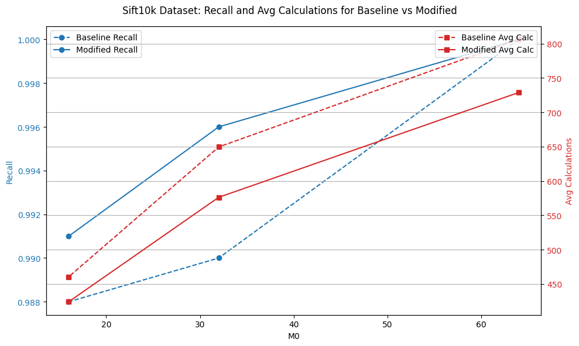
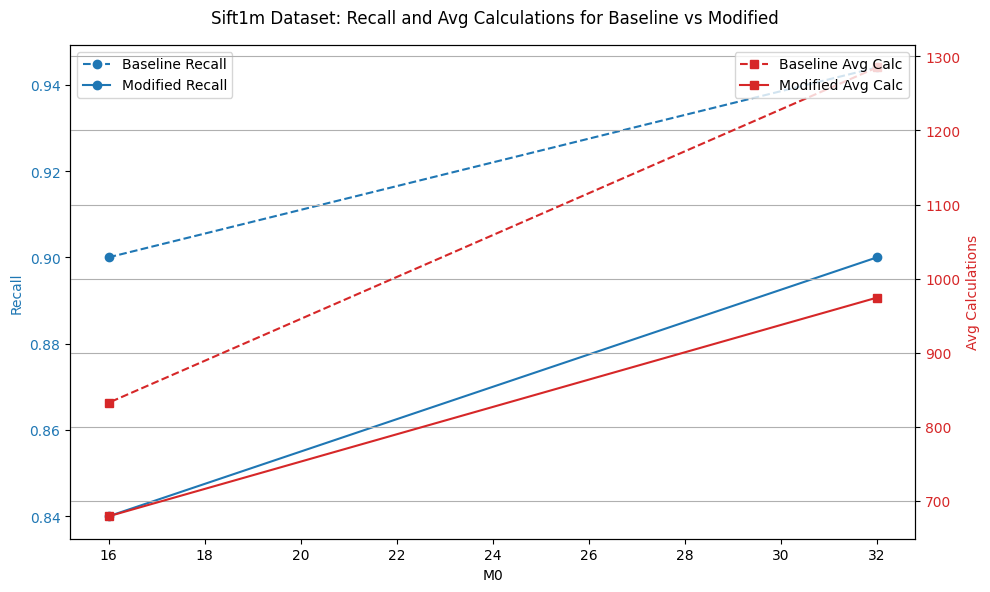

# Navigable Graphs Python
Python based research tool for studying navigable graphs for nearest neighbour search

Using the SIFT dataset:
```
python test-hnsw.py --dataset sift
```

# Modification
<b>Modified heuristics function</b>

The modification involves adding long edges. Instead of focusing only on the closest neighbors (as traditional nearest neighbor algorithms do), this function selects a portion of farthest neighbors (determined by long_edge_ratio) to increase the diversity of selected points. 

<b> NOTE:</b>
Since the computational complexity of the algorithm is quite high, a limited number of experiments were conducted. Perhaps with more detailed investigation and finer tuning of parameters, it may be possible to achieve improved metrics performance. Additional experiments and optimization may unlock the potential of the modified algorithm by improving its performance in different cases.

# Results

Experiments were performed on two datasets: sift10k and sift1m

<b>Sift10k:</b>

| Methods    | M0 | M  | Ef | Recall | Avg calc|
| --------   | -- |--- |--- |--------|---------|
| Baseline   | 64 | 32 | 64 | 1      | 806.21  |
| Modified   | 64 | 32 | 64 | 1      | 728.84  |
|                                              |
| Baseline   | 32 | 16 | 64 | 0.99   | 649.56  |
| Modified   | 32 | 16 | 64 | 0.996  | 576.23  |
|                                              |
| Baseline   | 16 | 8  | 64 | 0.988  | 460.48  |
| Modified   | 16 | 8  | 64 | 0.991  | 424.1   |

<b>Sift1m:</b>

| Methods    | M0 | M  | Ef | Recall | Avg calc|
| --------   | -- |--- |--- |--------|---------|
| Baseline   | 32 | 16 | 64 | 0.944  | 1285.08 |
| Modified   | 32 | 16 | 64 | 0.90   | 974.43  |
|                                              |
| Baseline   | 16 | 8  | 64 | 0.90   | 832.51  |
| Modified   | 16 | 8  | 64 | 0.84   | 679.27  |

Based on the experimental results on the Sift10k and Sift1m datasets, the following conclusions can be drawn:

<h2>Sift10k Dataset:</h2>
<b>Higher Recall and Efficiency:</b>

In all configurations, the Modified method consistently achieved higher recall compared to the Baselinemethod.
For example, with M0 = 32, M = 16, and Ef = 64, the recall increased from 0.99 (Baseline) to 0.996 (Modified).

<b>Reduction in Average Calculations:</b>

The Modified method also consistently reduced the number of average calculations required, indicating better efficiency.
For instance, with M0 = 32, M = 16, and Ef = 64, the average calculations dropped from 649.56 (Baseline) to 576.23 (Modified), representing an efficiency gain.

<b>Overall Performance:</b>

The Modified method provides both higher recall and reduced computation across all tested configurations, making it a clear improvement over the Baseline method for the Sift10k dataset.




<h2>Sift1m Dataset:</h2>

<b>Trade-off Between Recall and Efficiency:</b>

In this larger dataset, the Modified method showed a drop in recall compared to the Baseline method.
For example, with M0 = 32, M = 16, and Ef = 64, the recall decreased from 0.944 (Baseline) to 0.90(Modified).

<b>Significant Improvement in Efficiency:</b>

Despite the drop in recall, the Modified method significantly reduced the average number of calculations.
For the same configuration (M0 = 32, M = 16, Ef = 64), the average calculations reduced from 1285.08(Baseline) to 974.43 (Modified), showcasing a notable efficiency gain.

<b>Overall Performance:</b>

On the Sift1m dataset, the Modified method sacrifices some recall in exchange for much greater efficiency.
This trade-off might be beneficial in scenarios where computational efficiency is a higher priority than achieving maximum recall.




<h2>Summary:</h2>

On smaller datasets (Sift10k), the Modified method improves both recall and computational efficiency, making it a superior choice.

On larger datasets (Sift1m), the Modified method reduces computational overhead significantly but at the cost of some recall.
The choice between Baseline and Modified methods should depend on the specific requirements of the application (higher recall vs. efficiency).

